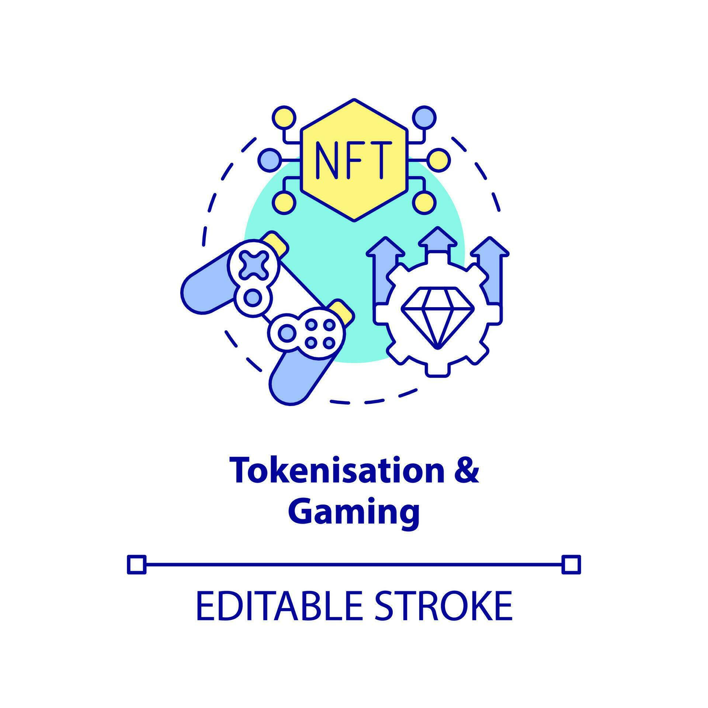
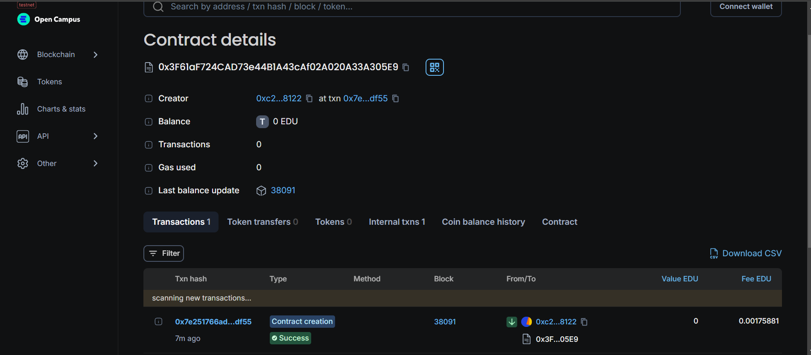

Here's a README.md file for your project:

---

# BasicSkillToken

## Vision

The **BasicSkillToken** project aims to create a tokenized reward system for educational platforms. By leveraging the ERC20 standard for tokens, this project provides a framework for rewarding students based on their quiz scores and tracking user profiles within the system. The contract supports different user roles such as instructors and students, ensuring appropriate reward distribution and user management.

## Project Features

- **ERC20 Token Implementation**: The contract implements the ERC20 token standard, allowing for basic token operations like transfer, approval, and transferFrom.
- **User Management**: Users can register with a profile that includes their name, email, role (instructor or student), and registration status.
- **Token Rewards**: Students can receive tokens as rewards based on their quiz scores. Instructors are excluded from receiving rewards.
- **Profile Updates**: Users can update their profiles, including changing their role and personal information.
- **Event Emission**: Events are emitted for key actions such as transfers, approvals, and user registrations to facilitate tracking and integration with external systems.

## Future Scope

- **Advanced User Roles**: Introduce more complex user roles and permissions to support diverse educational scenarios.
- **Integration with Learning Platforms**: Connect the token system with learning management systems (LMS) for automated reward distribution and profile management.
- **Governance and Voting**: Implement a governance mechanism where token holders can vote on changes or improvements to the system.
- **Enhanced Security**: Add additional security measures to protect user data and prevent unauthorized access or manipulation.

## Project Structure

- **`BasicSkillToken.sol`**: Contains the core smart contract with ERC20 functionality, user profile management, and token reward mechanisms.
  - `UserProfile`: Struct to hold user details.
  - `Mappings`: Store user balances, allowances, and profiles.
  - `Modifiers`: Ensure actions are performed by registered users.
  - `Functions`: Handle user registration, token rewards, and ERC20 standard operations.
  - `Events`: Log key actions like transfers and user registrations.

## Developer Details

- **Author**: Anamika
- **Email**: anamika23428@gmail.com

## deployment
chain Name: Educhain Open Campus Contract id:
0x3f61af724cad73e44b1a43caf02a020a33a305e9

---
